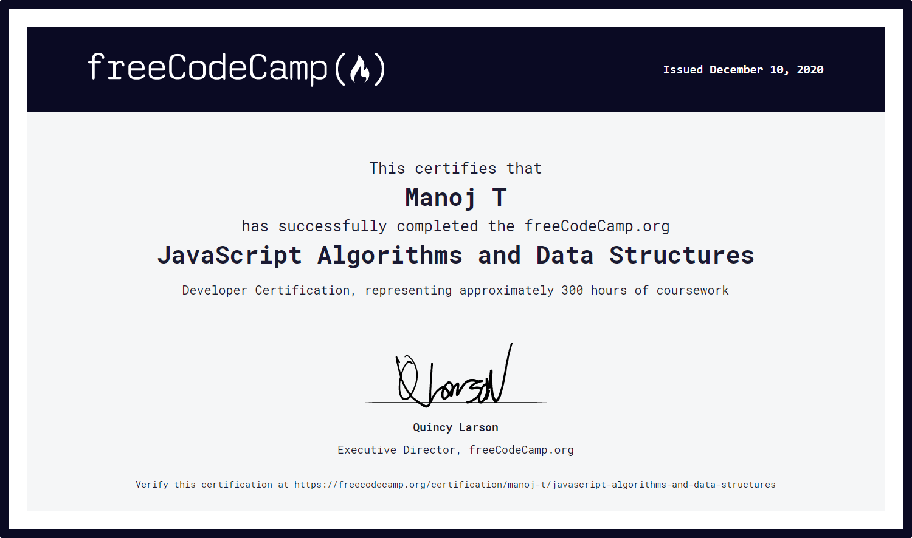

# FreeCodeCamp-JS-Algorithms-and-Data-Structures

This repository contains my algorithm solutions for freeCodeCamp's JavaScript Algorithms and Data Structures Projects certificate.

You can view the algorithm problems 👉[here](https://learn.freecodecamp.org/javascript-algorithms-and-data-structures/javascript-algorithms-and-data-structures-projects) and my certificate 👉[here](https://www.freecodecamp.org/certification/manoj-t/javascript-algorithms-and-data-structures).

